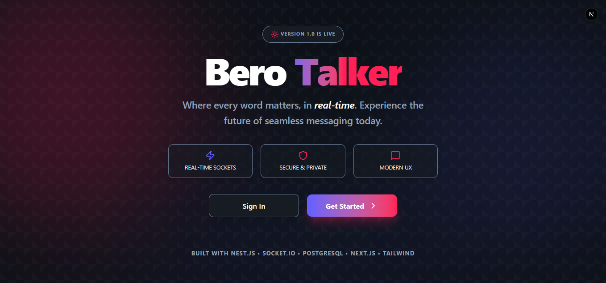
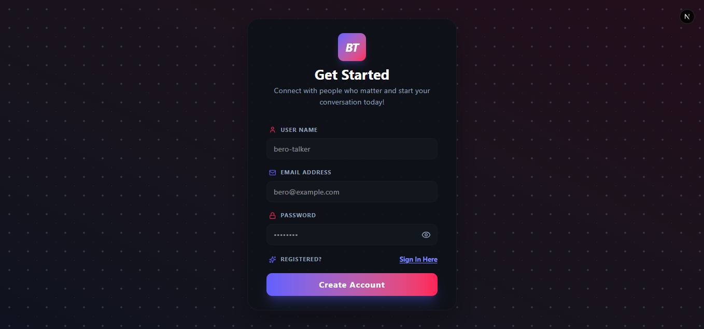
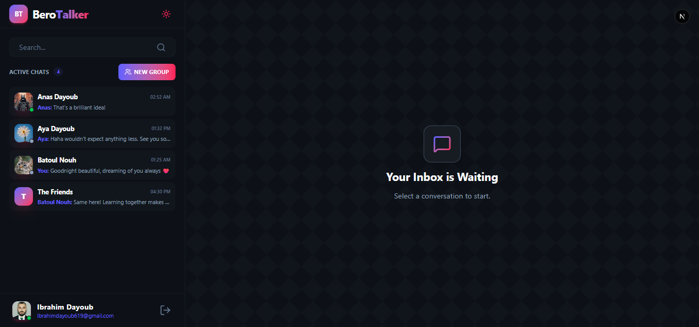
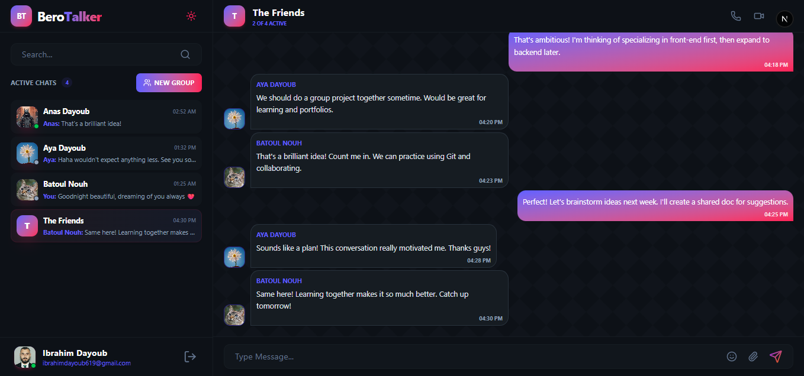
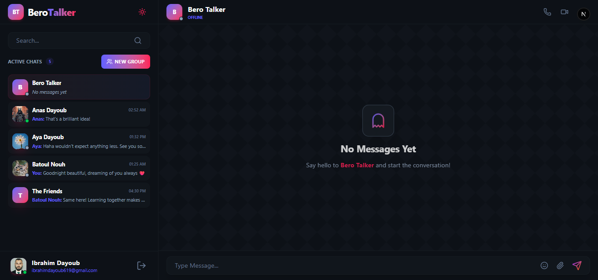
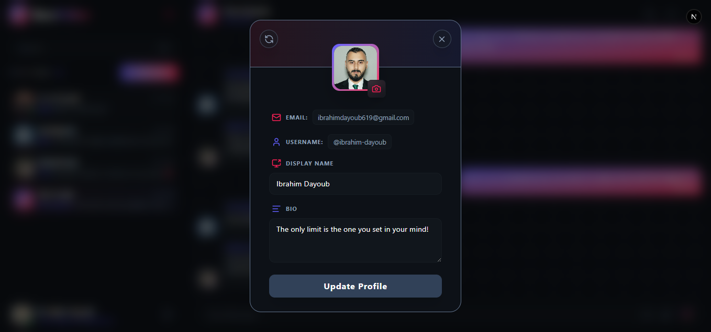
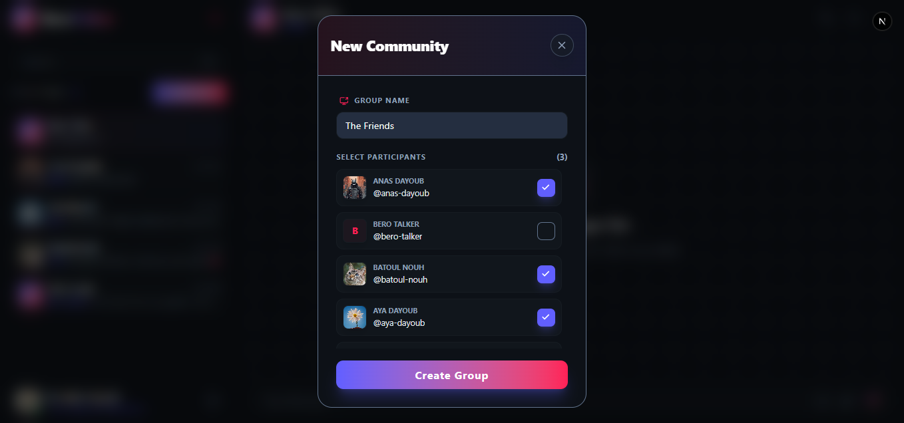
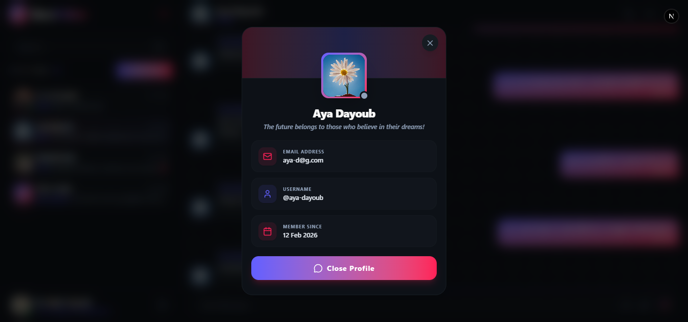
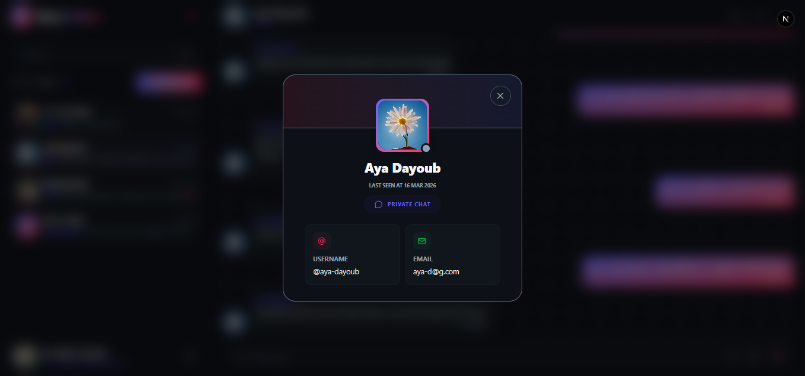
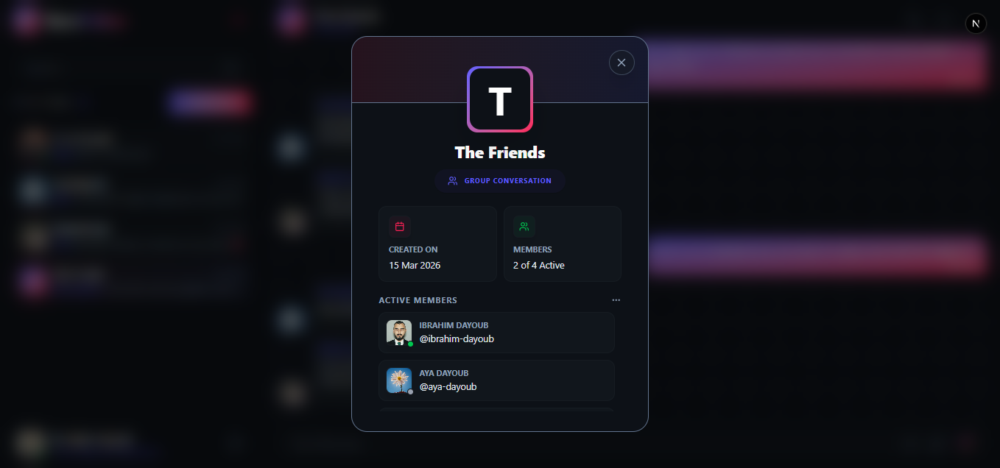

# 🎨 Bero Talker - Web App

The real-time messaging web client for **Bero Talker**. Built with **NextJs** and **TypeScript**, this application delivers a seamless chat experience with instant updates, secure authentication, and smooth state management.

---

> [!IMPORTANT]
> **📺 Watch the Demo:** Check out the **[App Demo Video](https://youtu.be/dWa0VzdyeFo)** to see **Bero Talker** in action, showcasing the smooth UI, chat management, and real-time actions.

---

## 🚀 Features

-  **Real-time Messaging:** Instant send/receive messages via WebSocket connection to the backend.
-  **Modern Authentication:** Secure login and registration flows using JWT tokens (Access & Refresh).
-  **Conversation Interface:** Clean, organized views for direct messages and group chats.
-  **Efficient Data Fetching:** Powered by **React Query** for automatic caching, background updates, and optimized server state management.
-  **Live User Experience:**
    -   See when other users are typing.
    -   Message read receipts (Sent, Delivered, Read).
    -   Real-time online/offline user presence indicators.
    -   Responsive Design: Optimized for desktop, tablet, and mobile devices.
    -   State Management: Efficient client-side state handling with Zustand.
    -   User Profiles: View and edit your profile, see other users' details.

---

## 🛠 Tech Stack

-   **Framework/Library:** [Next.js](https://nextjs.org/)
-   **Real-time Client:** [Socket.io-client](https://socket.io/docs/v4/client-api/)
-   **Styling:** [Tailwind CSS](https://tailwindcss.com/)
-   **State Management:** 
    -   [Zustand](https://github.com/pmndrs/zustand) (Client State)
    -   [TanStack Query (React Query)](https://tanstack.com/query/latest) (Server State)
-   **HTTP Client:** [Axios](https://axios-http.com/) for API calls
-   **Icons:** [Lucide React](https://lucide.netlify.app/)
-   **Form Validation:** [Zod](https://zod.dev/) (for schema validation with `zod`)
-   **Language:** TypeScript
  
---

## 📂 Project Structure

The project follows a modern Next.js App Router structure for maximum maintainability and scalability:

```
src/
├── app/
│ ├── (auth)
│ ├── chat/
│ ├── globals.css
│ ├── layout.tsx
│ └── page.tsx
│
├── components/
│ ├── modals/
│ └── ui/
│
├── lib/ # Core application logic and configurations
│ ├── hooks/ # Custom React hooks with React Query
│ │ ├── useAuth.ts
│ │ ├── useConversations.ts
│ │ ├── useMessage.ts
│ │ ├── useSocket.ts
│ │ └── useUser.ts
│ ├── api.ts
│ └── utils.ts
│
├── store/ # Zustand state management
│ └── useAuthStore.ts # Authentication state
│
└── types/ # Global TypeScript interfaces and types
└── user.types.ts # User, Profile types
```

---

## 📋 Prerequisites

Before running the project, ensure you have:
-   Node.js (v18 or higher)
-   `npm` or `yarn`

---

## ⚙️ Installation & Setup

1. **Clone the repository:**
   
   ```
   git clone https://github.com/ibrahimdayoub/talker-frontend.git
   cd talker-frontend
   ```
   
3. **Install dependencies:**
   
   ```
   npm install
   ```
   
5. **Environment Configuration: Create a .env file in the root directory and add your credentials:**
   
   ```
   NEXT_PUBLIC_API_URL=http://localhost:5000/api
   NEXT_PUBLIC_SOCKET_URL=http://localhost:5000
   ```
   
6. **Start the project:**
    
   ```
   npm run dev
   ```
   
---

## 📡 Connecting to the Backend

This frontend client communicates with the **[Bero Talker Backend API](https://github.com/ibrahimdayoub/talker-backend)**.

-   **REST API:** Used for authentication, fetching users, conversations, and message history.
-   **WebSocket (Socket.io):** Used for all real-time events (new messages, typing, status updates).

Make sure your backend server is running and the URLs in your .env file are correct.

---

## 📌 Screenshots












---

## 🔗 Related Project
This web app is powered by the **[Bero Talker Backend API](https://github.com/ibrahimdayoub/talker-backend)**

---
